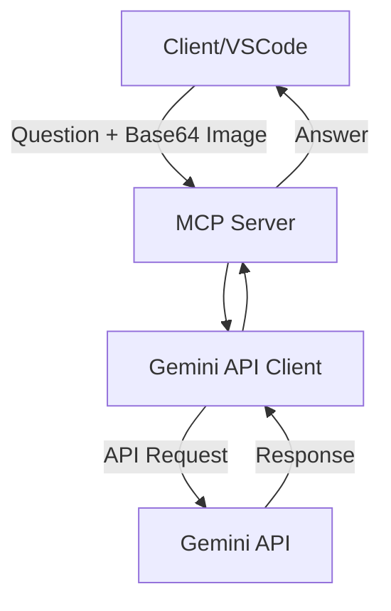
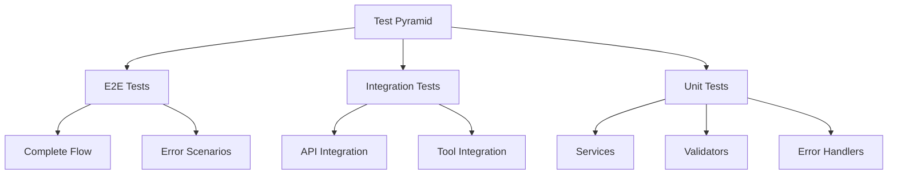

# Gemini Visual QA MCP Server Implementation Plan

## Project Overview
A Model Context Protocol (MCP) server in TypeScript that provides a tool for visual question answering using Google's Gemini API. The tool accepts a question and a base64 encoded image as input and returns an answer using the gemini-2.5-pro-preview-06-05 model.

## System Architecture



## Project Structure
```
gemini-vqa-mcp/
├── src/
│   ├── types/
│   │   ├── index.ts
│   │   └── tool-schemas.ts
│   ├── config/
│   │   ├── config.ts
│   │   └── logger.ts
│   ├── services/
│   │   ├── gemini.service.ts
│   │   └── image.service.ts
│   ├── tools/
│   │   └── visualqa.tool.ts
│   ├── utils/
│   │   ├── error-handler.ts
│   │   └── validators.ts
│   └── index.ts
├── test/
│   ├── unit/
│   │   ├── services/
│   │   ├── tools/
│   │   └── utils/
│   ├── integration/
│   └── e2e/
├── docs/
│   ├── installation.md
│   ├── usage.md
│   └── development.md
├── logs/
│   ├── error.log
│   └── combined.log
├── package.json
├── tsconfig.json
├── jest.config.ts
├── .eslintrc.js
├── .prettierrc
└── README.md
```

## Implementation Stages

### Stage 1: Project Setup (1-2 days)
1. Project Initialization
   ```bash
   mkdir gemini-vqa-mcp && cd gemini-vqa-mcp
   npm init -y
   npm install typescript @types/node ts-node
   npm install winston @types/winston
   ```

2. Development Environment Setup
   - Configure TypeScript
   - Setup ESLint and Prettier
   - Configure Jest for testing
   - Setup Winston logger
   - Configure Git hooks with Husky

3. Logging Implementation
   - Configure Winston logger with:
     - Debug level logging
     - Separate error logs
     - JSON formatting
     - Timestamp inclusion

### Stage 2: Core Infrastructure (2-3 days)
1. Configuration Management
   ```typescript
   interface Config {
     apiKey: string;
     model: string;
     maxImageSize: number;
     logLevel: string;
   }
   ```

2. Error Handling Strategy
   - Custom error classes
   - Thorough error logging
   - User-friendly error messages
   - No retry mechanism as per requirements

### Stage 3: Services Implementation (2-3 days)
1. Gemini Service
   - API initialization
   - Model configuration
   - Request handling
   - Error mapping

2. Image Service
   - Base64 validation
   - Size validation
   - Format checking
   - Error handling

### Stage 4: Tool Implementation (2-3 days)
1. Tool Schema Definition
   ```typescript
   interface VisualQAInput {
     question: string;
     image: string; // base64
   }
   
   interface VisualQAOutput {
     answer: string;
     confidence?: number;
   }
   ```

2. Implementation with Logging
   ```typescript
   class VisualQATool {
     async execute(input: VisualQAInput): Promise<VisualQAOutput> {
       logger.debug('Processing visual QA request', { question: input.question });
       // Implementation
     }
   }
   ```

### Stage 5: Testing (3-4 days)

## Testing Architecture


1. Unit Tests (95%+ coverage)
   - Services
   - Tool implementation
   - Validators
   - Error handlers

2. Integration Tests (85%+ coverage)
   - End-to-end flow
   - Error scenarios
   - Edge cases

3. E2E Tests
   - Complete flow testing
   - Real API integration

### Stage 6: Documentation (1-2 days)
1. Installation Guide
   - Prerequisites
   - Installation steps
   - Configuration guide

2. API Documentation
   - Tool schema
   - Input/Output formats
   - Error codes

3. Usage Examples
   - Basic usage
   - Error handling
   - Configuration examples

## Publishing Steps
1. Package Configuration
   ```json
   {
     "name": "gemini-vqa-mcp",
     "version": "1.0.0",
     "main": "dist/index.js",
     "types": "dist/index.d.ts",
     "files": [
       "dist",
       "README.md"
     ]
   }
   ```

2. Build and Test Process
   ```bash
   npm run build   # Compiles TypeScript
   npm run test    # Runs all tests
   npm run lint    # Checks code quality
   ```

3. NPM Publishing
   ```bash
   npm login
   npm publish
   ```

## Installation Instructions
```bash
# Install the package
npm install gemini-vqa-mcp

# Configure environment variables
GEMINI_API_KEY=your_api_key
GEMINI_MODEL=gemini-2.5-pro-preview-06-05

# Start the MCP server
npx gemini-vqa-mcp